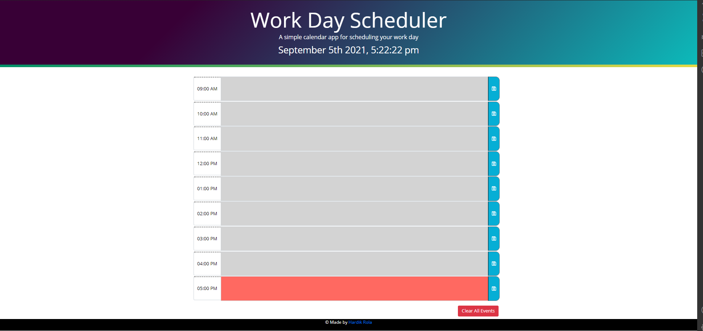
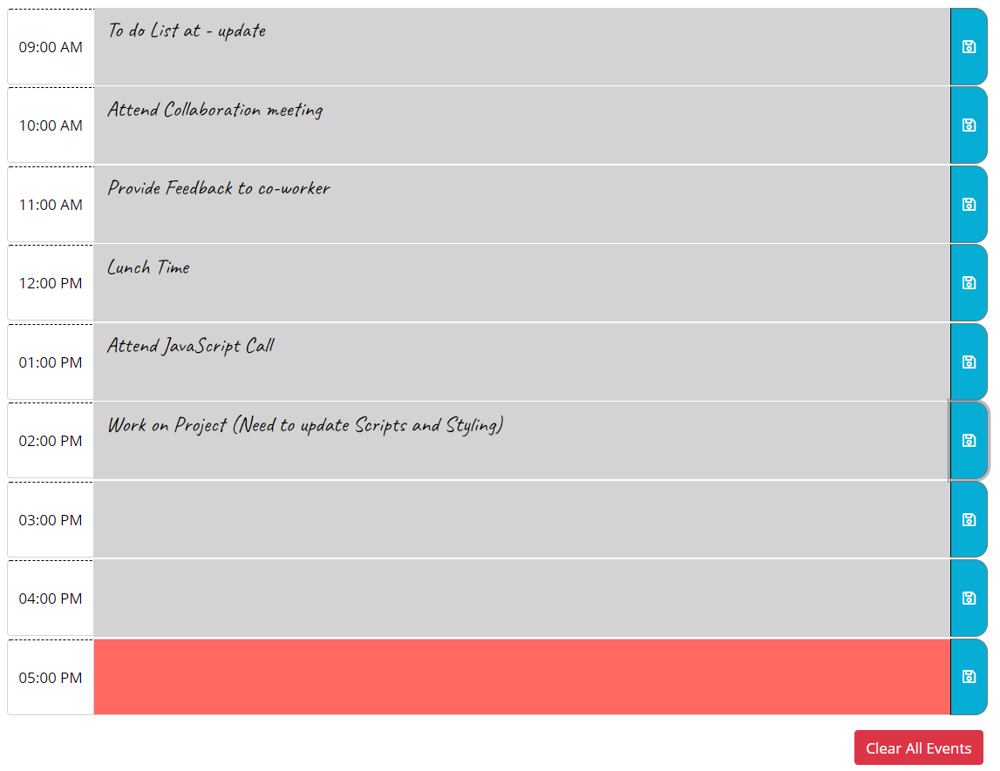
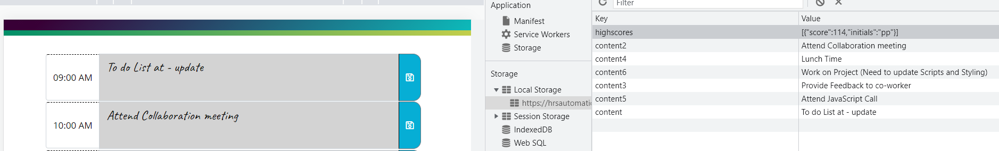

# Work Day Scheduler

1. [Description](#desc)
2. [Web Address](#web)
3. [Usage Tips](#usage)
4. [Contributing](#contr)
5. [License](#license)

<a name="desc"></a>

## 1. Description

A Work Day Scheduler is a daily planner to create a hourly schedule. The Current day is displayed at the top of the calendar. Followed by timeblocks for standard business hours. Each timeblock is color coded to indicate whether it is in the Past(Grey), Present(Red), or Future(Green). Click into a timeblock, enter and save an event.
<br>
<br>
The events will be saved entries to localStorage using the corresponding save button. While refreshing the browser will kept your entries to the time block until you Clear All Events by clicking on the Clear All Event button.
<br>
<br>

#### Screenshots:

## Full App View



## Timeblock and Clear button



## Timeblock and localStorage



<a name="web"></a>

## 2. How to Get There

Click on the below link to access the Portfolio

https://hrsautomation20.github.io/work_day_scheduler/

<b>OR</b><br> Copy and past below URL to your favorite browser

```html
https://hrsautomation20.github.io/work_day_scheduler/
```

---

<a name="usage"></a>

## 3. Usage Tips

1. On a start page, present day's date and time will be displayed.
2. Use Hourly timeblock to enter the event and click on Save Button.
3. You can overwrite the existing event by re-entering the new event details.
4. If you would like to remove all the events, Click on Clear All Event button to clear all the saved events in your localStorage.

---

<a name="contr"></a>

## 4. Contributing

For the Work Day Scheduler enhancement please contact the repo owner and provide the feedback. For local copy pull/download.zip files are welcome.

---

<a name="license"></a>

## 5. License

No License are required

---

© 2021 HR All Rights Reserved.
